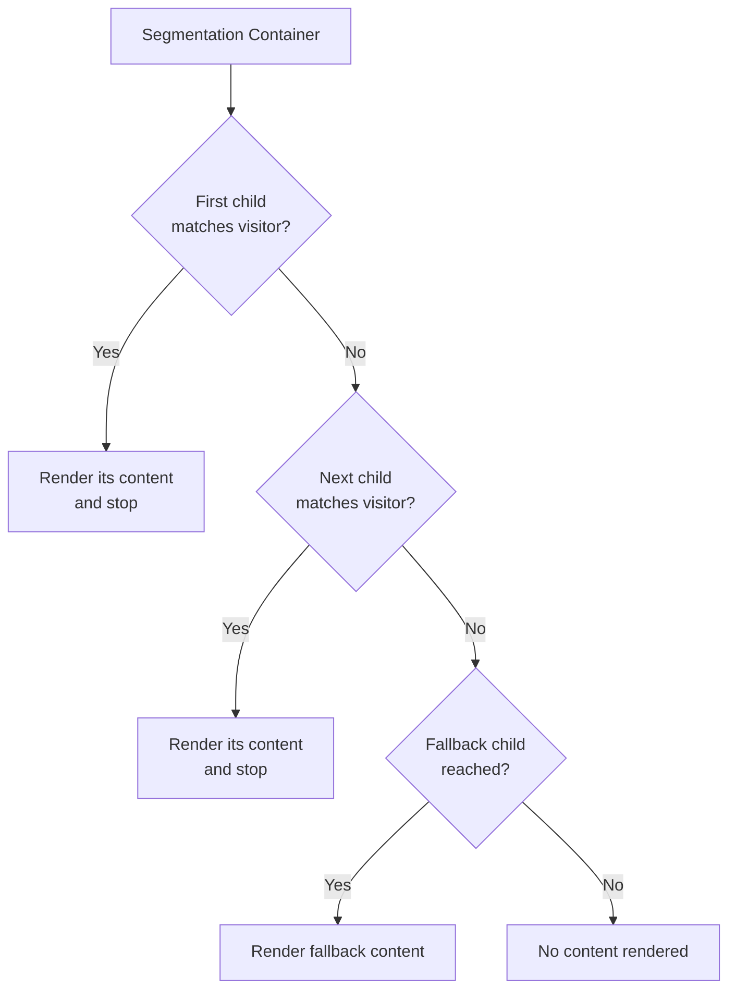

<Note>
  Content targeting is available in the **v2** and **v3** templates of the framework. The two templates do not yet have full feature parity — see [Version availability](#version-availability) below.
</Note>

Content targeting — also referred to as **segmentation** — lets a single page serve different content to different visitors based on where they are. The capability has two parts:

1. **Backend setup** — in the admin panel, define the regions (groupings of countries or US states) you want to target.
2. **Segmentation** — in the CMS, use the segmentation plugins to attach content to those regions, to individual countries, or to a fallback.

## Backend setup

Before content can be targeted at a group of countries or US states, the corresponding region must exist in the admin panel. A region is a named grouping that segmentation plugins link to later, so it can be defined once and reused across any number of pages.

There are two kinds of regions:

### Regions as country groupings

A country-based region groups any number of countries under a single name. Use this when you target the same set of countries repeatedly — for example, an **EMEA** region containing all relevant European, Middle Eastern, and African countries lets you make content available across EMEA, or narrow content down to a subset of it, without re-selecting the countries each time.

<Tip>
  Regions are only needed for **groups** of countries. To target a single country, use the [By Country](#by-country) plugin directly in the CMS — no region setup required.
</Tip>

### Regions as US state groupings

A US state region groups a specific set of US states under a single name. Use this when content should only apply to certain states.

<Warning>
  US states can **only** be targeted through regions. There is no plugin for targeting an individual state directly, so create a US state region even if it will contain only one state.
</Warning>

## Segmentation

Targeting is applied in the CMS through a parent plugin, the **Segmentation Container**, and a set of child plugins that each carry a targeting rule. The content you want to show for a given segment is placed *inside* the matching child plugin.

### The plugins

| Plugin                    | Role   | Targets                                                    |
| ------------------------- | ------ | ---------------------------------------------------------- |
| **Segmentation Container** | Parent | Holds the ordered list of segment children                 |
| **By Region (Country)**   | Child  | A country-based region defined in the backend              |
| **By Region (US state)**  | Child  | A US state region defined in the backend                   |
| **By Country**            | Child  | One or more individual countries — no region needed        |
| **Fallback**              | Child  | Always matches                                             |

### How evaluation works

When a page renders, the Segmentation Container evaluates its children **in order, top to bottom**, and the **first match wins**:

1. The container checks the first child's targeting rule against the visitor's location.
2. If it **matches**, that child's content is rendered and evaluation **stops** — no further siblings are considered.
3. If it does **not** match, the container moves on to the next child and repeats the check.
4. A **Fallback** child always matches, so evaluation always stops when it reaches one.

First-match-wins evaluation has two practical consequences:

- **Order matters.** Place the most specific segments first. If a broad segment (for example, a whole region) sits above a narrower one (a single country inside that region), the narrower segment will never be reached for visitors it was meant for.
- **End with a Fallback.** A Fallback child placed at the very end of the container guarantees that every visitor sees *something*. Without one, visitors who match no segment get no content from the container at all.

### Building a segmented section

<Steps>
  <Step title="Add a Segmentation Container">
    Insert the **Segmentation Container** plugin where the targeted content should appear on the page.
  </Step>
  <Step title="Add segment children">
    Inside the container, add one child plugin per audience — **By Region (Country)**, **By Region (US state)**, or **By Country** — and configure each child's targeting (link it to a backend region, or select the individual countries).
  </Step>
  <Step title="Place content inside each segment">
    Add the actual content plugins as children of each segment. This is what renders when that segment matches.
  </Step>
  <Step title="Finish with a Fallback">
    Add a **Fallback** child as the last item in the container and give it the default content that should show when no other segment matches.
  </Step>
</Steps>

## Version availability

| Plugin                     | v2 | v3          |
| -------------------------- | -- | ----------- |
| Segmentation Container     | ✅ | ✅          |
| By Region (Country)        | ✅ | ✅          |
| By Region (US state)       | ✅ | Not yet     |
| By Country                 | ✅ | Not yet     |
| Fallback                   | ✅ | ✅          |

<Info>
  In v3, the region plugin is currently available as a single **By Region** plugin that links to country-based regions only. Support for US state regions and individual-country targeting is planned; once added, v3 will have full parity with v2.
</Info>
