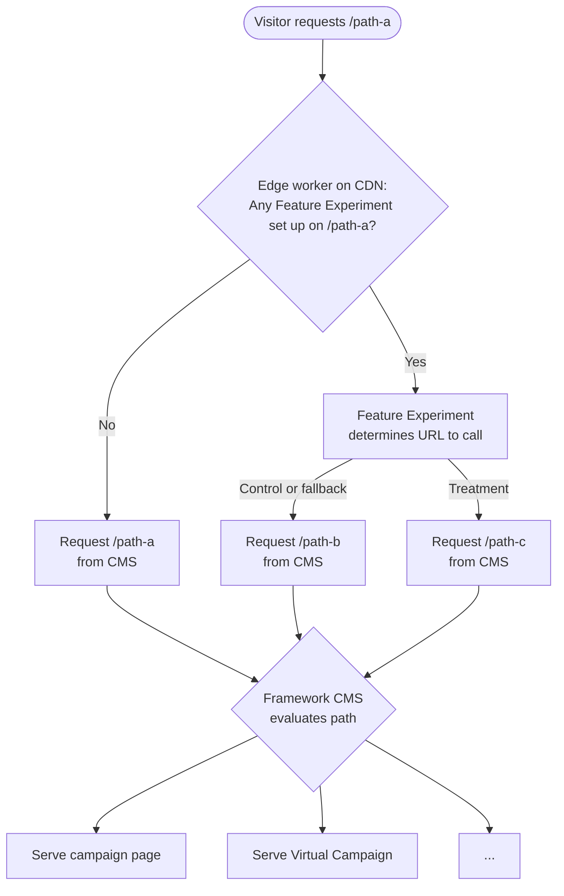

This guide covers creating a server-side Feature Experiment in Amplitude and wiring it to a page route on subs.ft.com through the Framewürk CMS.

## Setup and usage instructions

### Amplitude setup

The first piece of the puzzle is obtaining a Feature Flag from Amplitude.

<Steps>
  <Step title="Create the experiment">
    Create a new experiment and select the  **Feature** type.\\

    <Frame>
      
    </Frame>
  </Step>
  <Step title="Name and choose test type">
    Enter the experiment name and select the experiment type. We use **A/B test** type but as this setting is on the Amplitude side, it does not influence subsequent setup steps.\\

    <Frame>
      
    </Frame>
  </Step>
  <Step title="Configure metrics and targeting">
    Once an experiment is created, you can configure the metrics, targeting and the split between control and treatment. Please note that:

    - There can only be two variants: one called "control" and one called "treatment" to work with our setup. These are the defaults as well.
    - You can find the feature flag name under "Delivery" in the RHS column. Please make a note of it to use later in the Framewürk CMS:
  </Step>
  <Step title="Copy the feature flag name">
    You can find the feature flag name under **Delivery** in the RHS column. Please make a note of it to use later in the Framewürk CMS:\\

    <Frame>
      
    </Frame>
  </Step>
  <Step title="Set deployment">
    Set deployment to **subs-ft-com** in the **Deployment** section below the feature flag
  </Step>
  <Step title="Start the experiment">
    Start the experiment in Amplitude.
  </Step>
</Steps>

## Framewürk CMS setup

Second part of the puzzle is setting up the corresponding functionality in the Framewürk CMS.

<Steps>
  <Step title="Open Feature experiments">
    In the admin panel, open the [**Feature experiments**](https://subs.ft.com/en-gb/admin/cnk_amplitude/featureexperiment/) section.
  </Step>
  <Step title="Create a new feature experiment">
    Click to create a new feature experiment.
  </Step>
  <Step title="Enter a title">
    Add a **Title** for internal identification.
  </Step>
  <Step title="Set enabled state">
    Tick **Enabled** if the experiment should be active. Untick it to disable the experiment without deleting it.
  </Step>
  <Step title="Set the entry point">
    The **Entry point** defines the experiment URL on subs.ft.com. For example, `second-experiment` creates `https://subs.ft.com/second-experiment`.

    <Warning>
      Please avoid using the same entry point as either the control or treatment page URL, so CMS administrators can still edit the source page content easily.
    </Warning>
  </Step>
  <Step title="Paste the feature flag">
    Paste the **Experiment Feature Flag** you copied from Amplitude.
  </Step>
  <Step title="Select the control page">
    Select the **Control page**. This is also the fallback page if the experiment is stopped or the user is not targeted.
  </Step>
  <Step title="Select the treatment page">
    Select the **Treatment page**.
  </Step>
  <Step title="Save the experiment">
    Save the experiment. Allow up to five minutes for changes to propagate.
  </Step>
</Steps>

## Special cases and behaviours

- Changes made in the Framewürk CMS propagate to the edge, and the test can be used in 5 minutes or less (the mean propagation time is around 2m).
- Due to the need to delay serving content until we get a response from Amplitide, and the fact that Amplitude servers are hosted in Europe, it was decided to enable the feature experiments only in the countries in North America and Europe. Visitors from any other countries simply see the **control** and are not assigned a variant (we do not query Amplitude at all for them)
- Feature Experiments on the Framewürk side run until they are disabled manually. Even if the feature flag is deleted, they simply keep serving the **control**.
- The Feature Experiment functionality comes _before_ any other Framewurk CMS content is served. For example, if there is content

